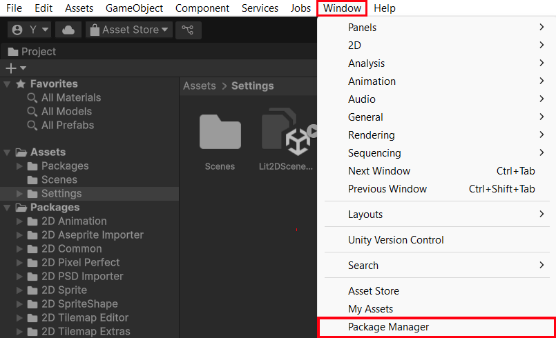
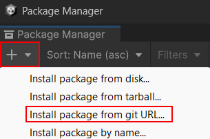
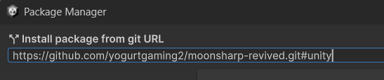

MoonSharp Revived
=========
https://www.moonsharp.org

This is a fork of the original MoonSharp Lua interpreter for C#. This fork focuses on fixing MoonSharp's long-standing bugs, extending MoonSharp functionality, and improving its compatibility with standard Lua (and especially Lua 5.2).

As of June 2025, the original MoonSharp is no longer available on the Unity Asset Store, and so this fork provides a UPM-compatible package.

I've tested this fork on Unity 6 and .NET 8, everything seems to work fine, other than a few warnings in the .NET project.

### Comparison
| Test Case                         | Lua 5.2             | Original MoonSharp         | MoonSharp Revived            |
|----------------------------------|----------------------------|------------------------------|------------------------------|
| **Char XOR**                | `test1234567890`           | `test123ô567890`             | `test1234567890`           |
| **Regex Trim**                   | `padded string`        | `pattern too complex`      | `padded string`         |
| **JSON Negative Integer**        | `-12345`                   | `Unexpected token: '-'`    | `-12345`                    |
| **__newindex Assignment Order**  | `B 2` <br> `A 1`           | `A 1` <br> `B ⠀`             | `B 2` <br> `A 1`            |
| **Byte String Roundtrip** | `0002405060FFFF`           | `00024050603F3F`           | `0002405060FFFF`           |

| Feature           | Lua 5.2 (`dkjson`/`cjson`) | Original MoonSharp            | MoonSharp Revived                |
|------------------|----------------------------------|----------------------------------|----------------------------------|
| `json.decode()`  | Commonly Available          |  Only `json.parse()`  | Alias for `json.parse()`      |
| `json.encode()`  | Commonly Available          |  Only `json.serialize()` | Alias for `json.serialize()`  |


## Installing via *Unity Package Manager* 
*(Shown in **Unity 6 Preview**, version `6000.0.2f1`)*
>   
> Open **Window > Package Manager** in the Unity Editor

>   
> Click on the "**+**" button and select "***Install package from git URL...***"

>   
> Enter **`https://github.com/yogurtgaming2/moonsharp-revived.git#unity`**

## Usage in Unity

Create a new script and include the MoonSharp namespace:
```csharp
using MoonSharp.Interpreter;
```
Use of the library is easy as:
```csharp
void Start()
{
	string script = @"    
		function fact (n)
			if (n == 0) then
				return 1
			else
				return n*fact(n - 1)
			end
		end
		return fact(5)";
	DynValue res = Script.RunString(script);
	Debug.Log(res.Number);
}
```
For more in-depth tutorials, samples, etc. please refer to http://www.moonsharp.org/getting_started

## MoonSharp Features
* 99% compatible with Lua 5.2 (with the only unsupported feature being weak tables support) 
* Support for metalua style anonymous functions (lambda-style)
* Easy to use API
* Runs on Ahead-of-time platforms like iOS
* Runs on IL2CPP converted code
* No external dependencies, implemented in as few targets as possible
* Easy and performant interop with CLR objects, with runtime code generation where supported
* Interop with methods, extension methods, overloads, fields, properties and indexers supported
* Support for the complete Lua standard library with very few exceptions (mostly located on the 'debug' module) and a few extensions (in the string library, mostly)
* Threading-friendly Async methods
* Supports dumping/loading bytecode for obfuscation and quicker parsing at runtime
* An embedded JSON parser (with no dependencies) to convert between JSON and Lua tables
* Easy opt-out of Lua standard library modules to sandbox what scripts can access (`Globals`, `CoreModules` & more)
* Easy to use error handling (script errors are exceptions)
* Support for coroutines, including invocation of coroutines as C# iterators 
* REPL interpreter, plus facilities to easily implement your own REPL in few lines of code

For highlights on differences between MoonSharp and standard Lua, see http://www.moonsharp.org/moonluadifferences

## License

The program and libraries are released under a 3-clause BSD license - see the license section.

Parts of the string library are based on the KopiLua project (https://github.com/NLua/KopiLua).
Debugger icons are from the Eclipse project (https://www.eclipse.org/).